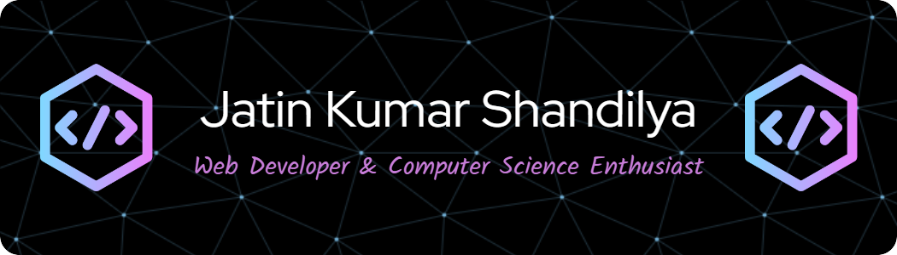

- 👨‍🎓 Computer Science Engineering student at JECRC, Jaipur.

- 👀 I’m looking for Internship/Full-Time(PPO) Opportunities/roles.

- 🌱 Proficient in languages such as *C and C++*

- 👨‍💻 About me: [Portfolio](https://portfolio-six-delta-62.vercel.app/)

- 💬 Ask me about *HTML, CSS, JavaScript and Cloud Computing Concepts*

- 📫 How to reach me: [https://www.linkedin.com/in/jatin-kumar-shandilya-4a4460202/](https://www.linkedin.com/in/jatin-kumar-shandilya-4a4460202/)

<h3 align="left">Connect with me:</h3>

<h3 align="left">Languages and Tools:</h3>

                    

# 📊 GitHub Stats:
 
 

## 🏆 GitHub Trophies

  

